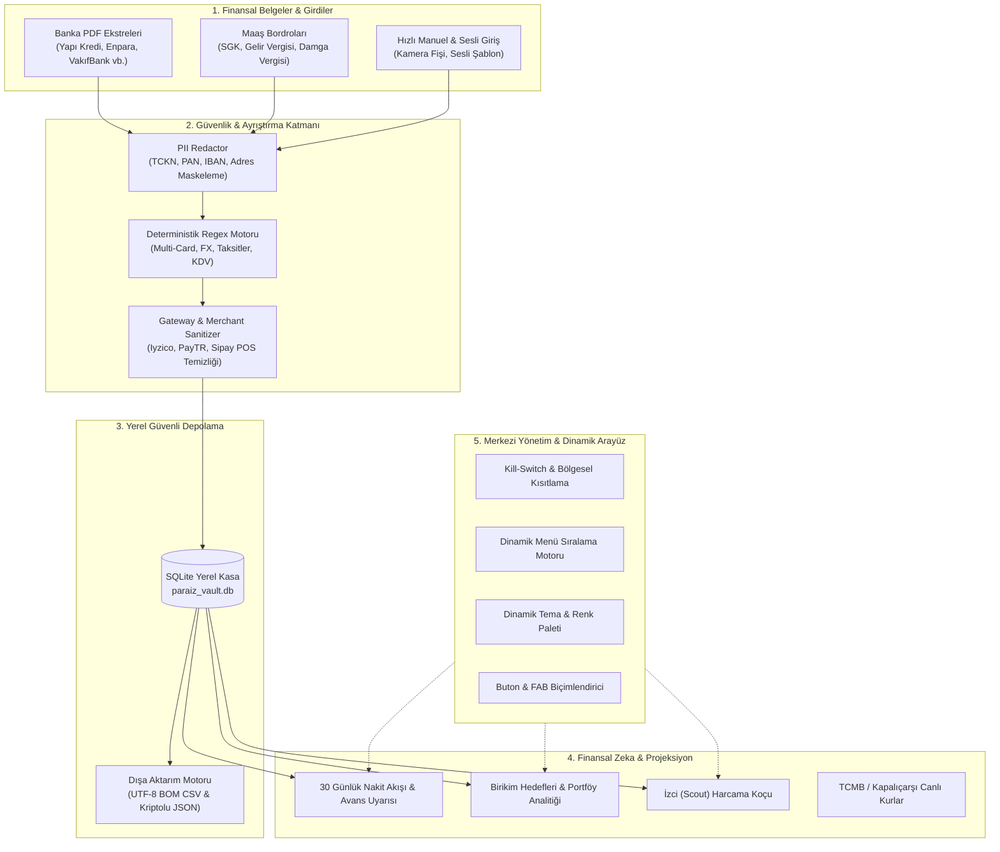

# Paraİz (MoneyTrace) - Proje Genel Bakış ve Sistem Mimarisi

Paraİz, kullanıcıların banka kredi kartı hesap özetlerini, vadesiz hesap hareketlerini ve maaş bordrolarını **hiçbir sunucuya göndermeden**, **tamamen cihaz içinde (%100 On-Device)** deterministik algoritmalarla ayrıştıran, analiz eden ve yöneten yeni nesil bir kişisel finans ve bütçe yönetim platformudur.

---

## 1. Temel Prensipler ve Tasarım Felsefesi

1. **Sıfır Bilgi Güvenliği (Zero-Knowledge Architecture)**:
   - Kullanıcının hiçbir finansal verisi, ekstresi, harcama kaydı veya kimlik bilgisi harici bir sunucuya iletilmez.
   - Veritabanı cihazın yerel depolama alanında SQLite (`paraiz_vault.db`) üzerinde tutulur.
2. **Kişisel Veri Maskeleme (PII Redactor)**:
   - TCKN, Kredi Kartı Numarası (PAN), IBAN, telefon numarası ve ev/iş adresi gibi hassas kişisel veriler hafızaya alınmadan önce regex motoruyla maskelenir.
3. **Deterministik & Hukuki Zeka**:
   - Yıllık kart aidatı kesintilerini tespit edip **6502 sayılı Kanun** ve **Yargıtay 13. Hukuk Dairesi** emsal kararlarıyla tek tıkla resmi iade dilekçesi üretir.
   - Nakit avans işlemlerini tespit ederek aylık %5.00 akdi faiz yükünü hesaplar ve acil ödeme takvimine bağlar.
4. **Çapraz Platform (Android & iPhone)**:
   - Tek bir modern Flutter çekirdeği üzerinden hem Android hem iOS (iPhone/iPad) cihazlarda yerel performans ve akıcı animasyonlarla çalışır.
5. **Tam Yönetilebilirlik (Admin Control Panel)**:
   - Modüller, ülke kısıtlamaları, alt menü sıralaması, tema renkleri, buton stilleri ve veri modları merkezi yönetim panelinden anında ayarlanabilir.

---

## 2. Sistem Mimarisi Şeması

