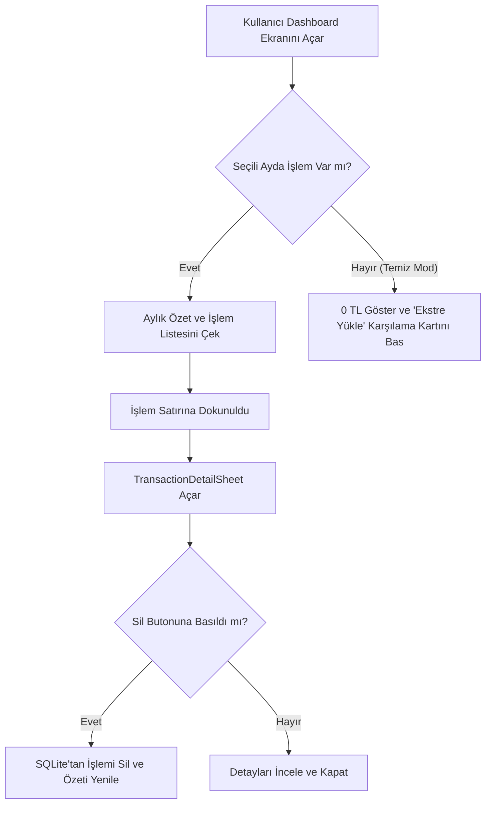
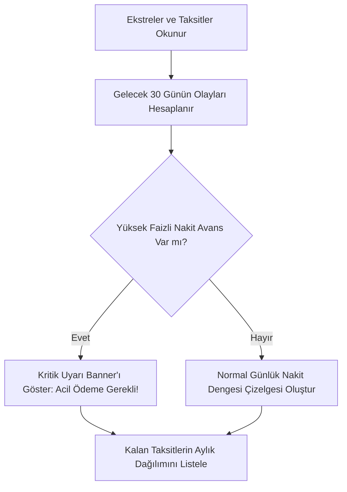
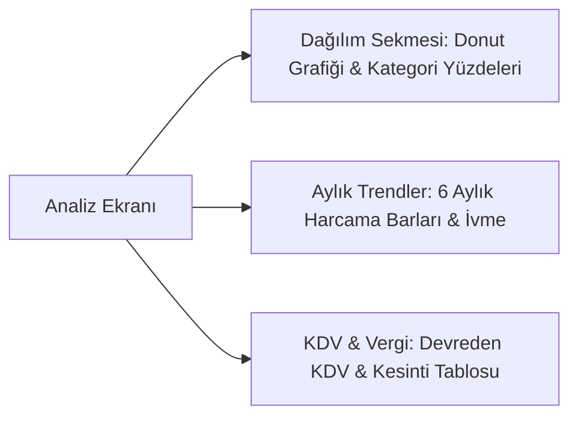

# Paraİz (MoneyTrace) - Menüler ve Çalışma Mantığı

Bu dokümanda uygulamadaki 5 ana ekranın, alt modüllerin ve yardımcı pencerelerin çalışma prensipleri, kullanıcı akışları ve teknik mantıkları ayrıntılı olarak açıklanmıştır.

---

## 1. Ana Sayfa (Dashboard)

### Çalışma Mantığı:
- **Dönem Gezgini (`yyyy-MM`)**: Kullanıcı `<` ve `>` oklarına dokunduğunda seçilen ay güncellenir. SQLite veritabanı seçilen aya göre filtrelenir.
- **Finansal Özet Kartları**:
  - Toplam Gider (`DEBIT` işlemleri toplamı)
  - Toplam Gelir (`CREDIT` işlemleri toplamı)
  - Net Fark (`Gelir - Gider`). Pozitifse yeşil, negatifse kırmızı renkte gösterilir.
- **Sıfır-Veri (Clean Data) Desteği**: Veritabanı boşsa kullanıcıya 0 TL başlangıç ve şık bir "PDF Ekstre Yükle" karşılama kartı sunulur.
- **İşlem Detay & Silme**: Her bir harcama satırına dokunulduğunda modal açılır; işlem detayları görüntülenir ve istenirse işlem silinebilir.

---

## 2. Nakit Akışı & 30 Günlük Projeksiyon (Cashflow)

### Çalışma Mantığı:
- **Gelecek 30 Günün Haritası**: Ekstre kesim günleri, kredi kartı son ödeme tarihleri ve maaş günü otomatik takvime işlenir.
- **Nakit Avans Koruma Alarmı**: Kullanıcının çektiği nakit avanslar (aylık %5.00 akdi faiz) tespit edilir ve "Acil Kapatılacak Öncelikli Borç" olarak en üste taşınır.
- **Taksit Projeksiyonu**: Devam eden taksitli alışverişlerin (örn. 1/3, 2/6) kalan aylara dağılımı listelenir.

---

## 3. Harcama Analitiği & KDV (Analysis)

### Çalışma Mantığı:
- **Sekme 1: Harcama Dağılımı**: Kategori bazlı harcama oranları donut grafiğinde gösterilir.
- **Sekme 2: Aylık Trendler**: Son 6 ayın harcama ortalaması, ivmesi (+%2,8) ve en yoğun ay analizi karşılaştırılır.
- **Sekme 3: KDV & Stopaj**: Şirket veya serbest çalışanlar için devreden KDV, ödenen KDV ve gelir vergisi kesintileri listelenir.

---

## 4. Birikim Hedefleri (Goals)

### Çalışma Mantığı:
- **Kilometre Taşları**: Kullanıcı yeni hedef ekleyebilir (Ev peşinatı, Yeni araba, Tatil, vb.).
- **İnteraktif Katkı**: Sabit tutar yerine +₺1.000, +₺2.500, +₺5.000, +₺10.000 çipleri veya özel tutarla birikim eklenir.
- **Kalan Ay ve Tasarruf İhtiyacı**: Hedefe ulaşmak için ayda ne kadar kenara konulması gerektiği dinamik hesaplanır.

---

## 5. Varlıklar & Bağlı Kartlar Portföyü (Assets & Portfolio)

### Çalışma Mantığı:
- **Sekme 1: Birikim & Emtia**: Altın, döviz, fon ve nakit varlıkların güncel TL karşılıkları (TCMB veya Kapalıçarşı canlı verisiyle).
- **Sekme 2: Bağlı Kartlar**:
  - Toplam Kredi Kartı Limiti
  - Aktif Dönem Borcu
  - Kalan Kullanılabilir Limit
  - Kart Sahibi / Aile Üyesi Ataması (Ahmet, Eş, Çocuk 1, Çocuk 2).
- **Piyasa Haberleri (Market News)**: RSS üzerinden tamamen ücretsiz, sıfır maliyetle finans ve ekonomi haberleri gösterilir.

---

## 6. Yardımcı Modal Pencereleri (Sheets)

1. **Deterministik Ekstre Yükleme (`StatementUploadSheet`)**:
   - PDF ekstre veya maaş bordrosu seçilir.
   - PII maskelenir, POS isimleri temizlenir, aidatlar ve taksitler ayrıştırılıp yerel veritabanına işlenir.
2. **Hızlı Giriş (`QuickEntrySheet`)**:
   - Kamera fiş okuma ve sesli harcama şablonları ("Benzin 1500 TL", "Market 450 TL") tek dokunuşla girilir.
3. **Aile Bütçesi Paylaşımı (`FamilyBudgetSheet`)**:
   - Aile paketi (maksimum 4 kişi) kapsamında aile üyeleri harcama limitleri yönetilir.
4. **Üyelik & Abonelik Paketleri (`SubscriptionPlansSheet`)**:
   - Bireysel Aylık, Bireysel Yıllık ve Aile Paketi seçenekleri listelenir.
5. **Akıllı Ekstre Sihirbazı (`StatementSmartWizardDialog`)**:
   - Kart aidatı, nakit avans faizi ve abonelikleri tespit edip tek dokunuşla resmi iade dilekçesi üreten akıllı pencere.

---

## 7. Ortak Mikro-Etkileşimler ve Animasyon Mimarisi

Tüm ekranlarda uygulanan standart mikro-etkileşimler:
- **FloatingCapsuleNavBar**: Ekranın 14dp üstünde süzülen, süper-elips buzlu cam alt gezinti çubuğu.
- **DynamicIslandCapsule**: En üstte (<= %24 ekran boyutu) yüzen, drag-to-dismiss destekli elektrikli araç vs dizel bakım tasarrufu hapı.
- **InAppNotificationSheet**: Alttan çıkan (<= %25 ekran boyutu), drag-down dismiss özellikli yönlendirici modal.
- **PulseMetricBadge**: Canlı net fark, lider kategori ve canlı kasa göstergelerinde çift katmanlı neon radar rozeti.
- **RadarCheckoutButton**: Tüm onay ve kaydet butonlarında radar nabız dalgası ve onay animasyonu.
- **MorphingShareButton & InteractiveFileUploadButton**: Paylaşım ve dosya yükleme işlemlerinde akıcı kapsül morf geçişleri.
- **MorphingSegmentedBar**: Analiz, Kasa ve Hedefler sekmeleri arasında yay fiziğiyle kayan hap gösterge.
- **LaserShimmerCard**: Ayarlar ve VIP alanlarında sürekli süpüren neon lazer ışını.
- **RollingNumberTicker**: Tutarlarda akıcı yuvarlanan kübik rakam sayacı.

