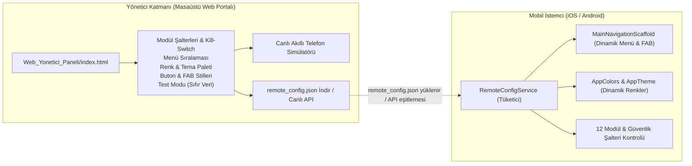
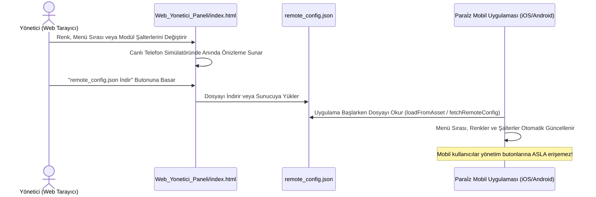

# Paraİz (MoneyTrace) - Ayrık Web Yönetici Portalı ve Uzaktan Kontrol

> [!IMPORTANT]
> **Güvenlik Mimarisi (Ayrık Web Paneli):**
> Yönetici paneli ve hassas kontrol şalterleri, istemci tarafında tersine mühendislik (reverse engineering) veya yetkisiz erişim risklerini önlemek amacıyla **mobil uygulama içerisinden tamamen çıkartılmış**; masaüstünde bağımsız çalışan bir **Web Portalı (`Web_Yonetici_Paneli/index.html`)** haline getirilmiştir.

---

## 1. Mimari Genel Bakış

Mobil uygulama sadece konfigürasyon tüketen **yetkisiz (unprivileged client)** bir istemcidir. Yönetici ise masaüstündeki Web Portalından tüm görsel ve operasyonel ayarları canlı simülatör üzerinden yönetir, `remote_config.json` dosyasını üretir ve uygulamaya dağıtır.

---

## 2. Web Yönetici Portalı Yetenekleri (`Web_Yonetici_Paneli/index.html`)

| Sekme | Başlık | İşlev & Kontroller |
| :--- | :--- | :--- |
| **1** | **Modül Şalterleri & Kill-Switch** | 12 ana modülü tek tıkla açıp kapatma. **Test Modu (Temiz Veri)** şalteri sayesinde uygulamanın ₺0,00 ile başlamasını ve boş karşılama ekranı vermesini sağlama. |
| **2** | **Menü Sıralaması (Bottom Bar)** | Alt çubuktaki 5 sekmenin (`Ana Panel`, `Nakit Akışı`, `Analiz`, `Hedefler`, `Varlıklar`) sırasını `▲ / ▼` butonlarıyla değiştirme, istenen sekmeyi gizleme/gösterme. |
| **3** | **Renk & Tema Paletleri** | Kurumsal hazır paletler (*Elektrik Mavisi*, *Zümrüt Finans*, *Gece Mavisi*, *Asil Mor*, *Siber Amber*) veya özel Hex renk seçicileri ile anında marka rengi değiştirme. |
| **4** | **Buton Stilleri & UX** | Köşe yuvarlaklığı (0-28px radius), buton gölge derinliği (elevation) ve Yüzen Buton (FAB) konumu (`endFloat` / `centerDocked` / `hidden`). |
| **5** | **Canlı JSON & İndirme** | Şemaya %100 uyumlu `remote_config.json` çıktısını canlı görme, tek tıkla panoya kopyalama veya indirme. |

---

## 3. Canlı Telefon Simülatörü

Web arayüzünün sağ tarafında konumlandırılan gerçekçi akıllı telefon çerçevesi (iPhone / Android):
- Seçilen her renkte,
- Değiştirilen her buton eğiminde veya gölgesinde,
- Sıralaması değiştirilen her alt menü sekmesinde,
- Açılıp kapatılan her modülde
**0 milisaniye gecikmeyle anında güncellenir** ve yöneticinin sonucu anında görmesini sağlar.

---

## 4. Güvenli Dağıtım Akış Diyagramı

