# Paraİz (MoneyTrace) - Görsel Katalog & Arayüz Tasarımları

Bu doküman, Paraİz ekosisteminin tüm modüllerine, web yönetim konsoluna ve alternatif arayüz tasarım varyasyonlarına ait yüksek çözünürlüklü görsel tasarım kataloğudur. Tüm görseller `Gorseller/` alt klasöründe yer almaktadır.

---

## 1. Yönetim ve Web Portalı Görselleri

### 1.1 Web Yönetici Portalı (Canlı Telefon Simülatörlü)
- **Dosya Konumu:** [`Web_Yonetici_Paneli/index.html`](file:///d:/Users/26075759/OneDrive%20-%20AR%C3%87EL%C4%B0K%20A.%C5%9E/Desktop/Ev%20Ekonomisi/Web_Yonetici_Paneli/index.html)
- **Ekran Görseli:** 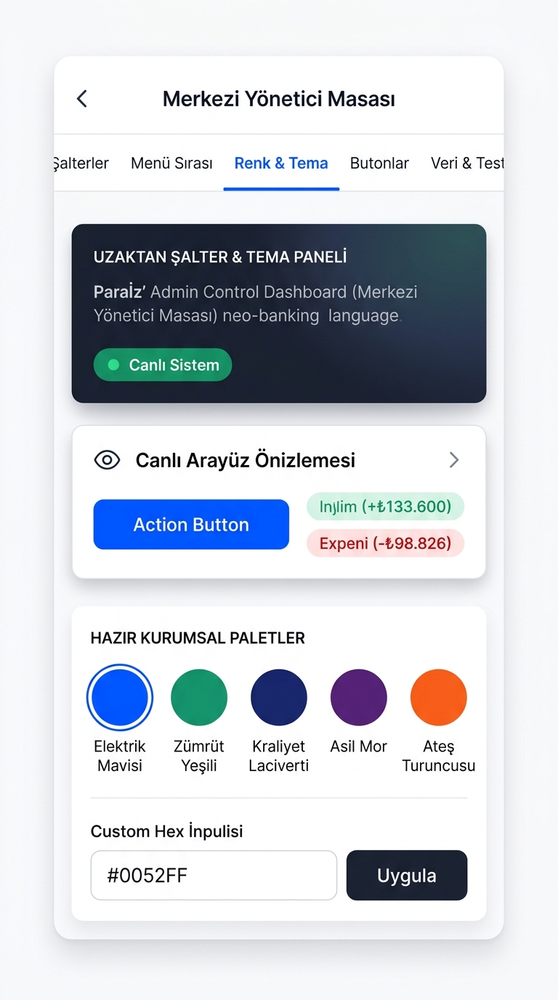
- **Açıklama:** Solda 5 sekmeli merkezi yönetim araçları (Modül Şalterleri, Menü Sıralaması, Renk & Tema Paleti, Buton Radius/Gölge ayarları), sağda ise yapılan her değişikliği anında gösteren etkileşimli akıllı telefon simülatörü yer alır.

---

## 2. Mobil Uygulama Temel Ekran Tasarımları

### 2.1 Ana Finansal Gösterge Paneli (Dashboard)
- **Görsel:** 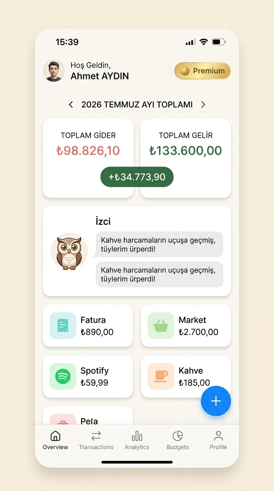
- **Özellikler:** Dinamik net varlık kartı, aylık toplam gelir ve gider göstergeleri, son işlemler listesi ve deterministik PDF yükleme karşılama alanı.

### 2.2 Nakit Akışı & 30 Günlük Projeksiyon
- **Görsel:** 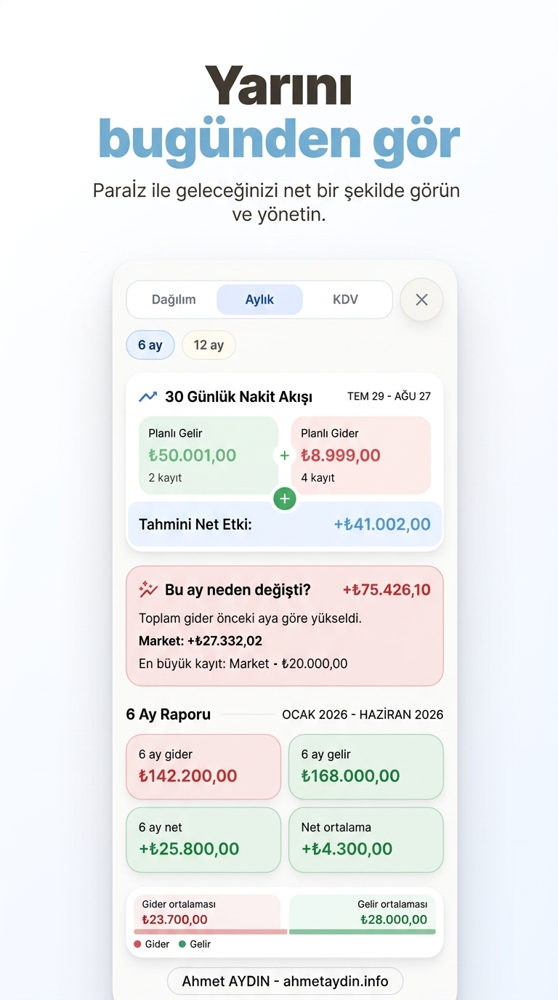
- **Özellikler:** Gelecek 30 günün bakiye projeksiyon grafiği, yaklaşan faturalar, taksit ödemeleri ve maaş günleri simülasyonu.

### 2.3 Kategori & Harcama Zekası Analizi
- **Görsel:** 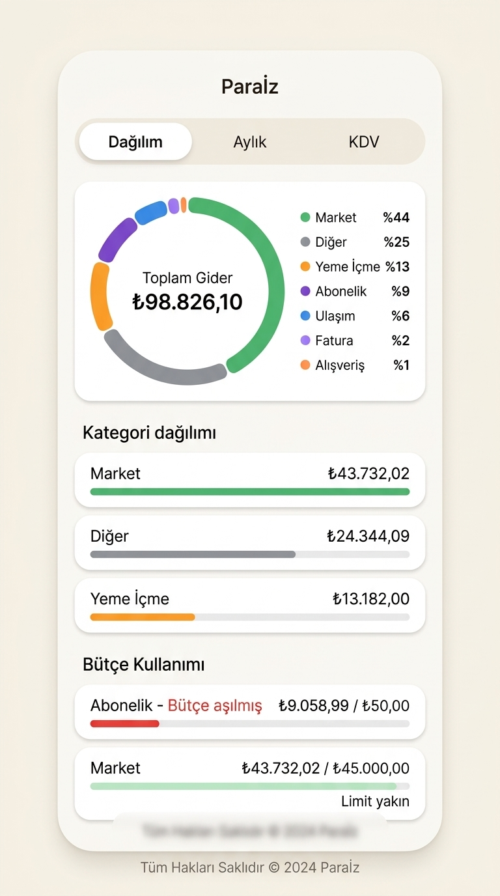
- **Özellikler:** Donut pasta grafiklerle harcama dağılımı (Market, Akaryakıt, Faturalar vb.), bütçe limit çubukları ve anomali uyarıları.

### 2.4 Hedefler & Birikim Kumbara Modülü
- **Görsel:** 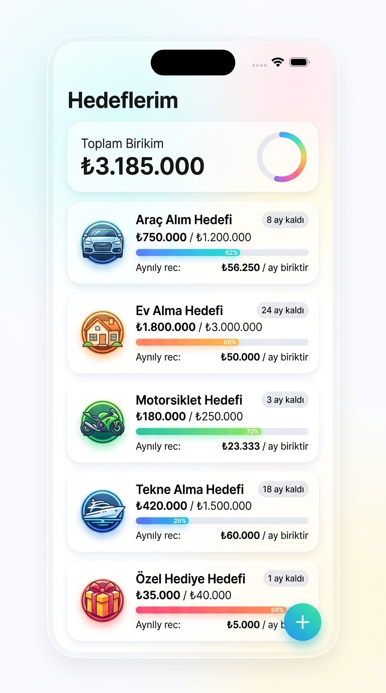
- **Özellikler:** Araba, ev, tatil gibi finansal hedefler; tamamlanma yüzdesi, kalan tutar ve hedefe ulaşmak için kalan tahmini gün sayısı.

### 2.5 Varlık & Altın / Döviz Portföyü
- **Görsel:** 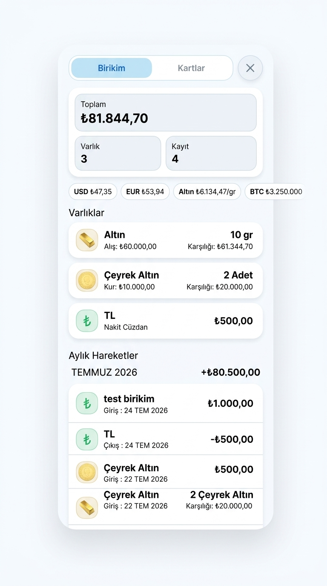
- **Özellikler:** Çeyrek/gram altın, döviz (USD/EUR), hisse senedi ve gayrimenkul varlıklarının canlı TCMB/Kapalıçarşı kurlarıyla TL karşılığı.

### 2.6 Aile Bütçesi Senkronizasyonu
- **Görsel:** 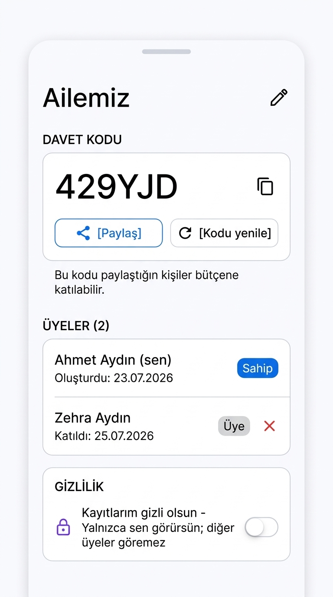
- **Özellikler:** Maksimum 4 kişilik aile paketi, eşler arası ortak harcama takibi ve ortak mutfak bütçesi limiti.

### 2.7 Hızlı İşlem Ekleme (Quick Entry)
- **Görsel:** 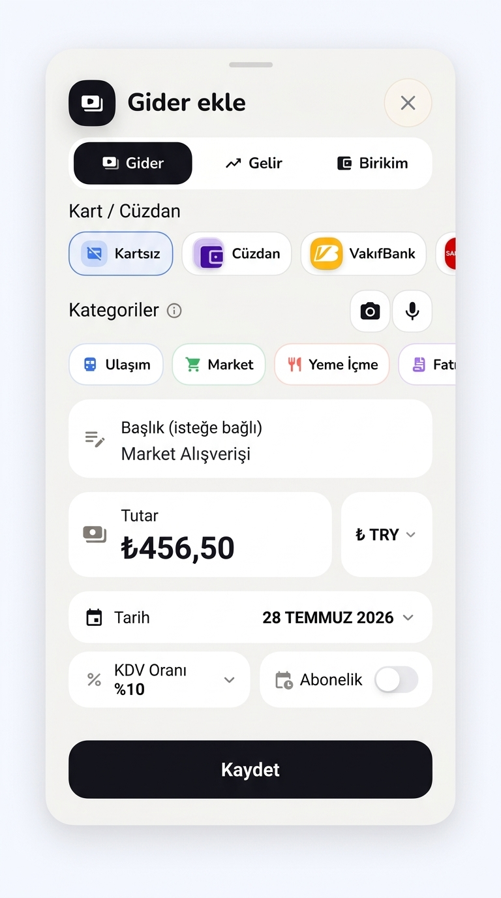
- **Özellikler:** Numpad ile 3 saniyede harcama/gelir girişi, kategori ve hesap seçimi.

---

## 3. "Crystal Glass" Lüks Cam Arayüz Tasarım Varyasyonları

Uygulamanın gelecekteki temalarında kullanılmak üzere hazırlanan ultra-modern şeffaf cam (Frosted Glass / Glassmorphic) konsept tasarımları:

1. **Crystal Goals (Hedefler):** 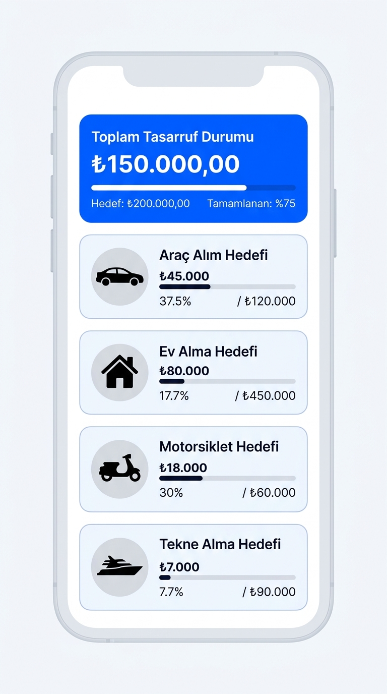
2. **Crystal Dashboard (Ana Panel):** 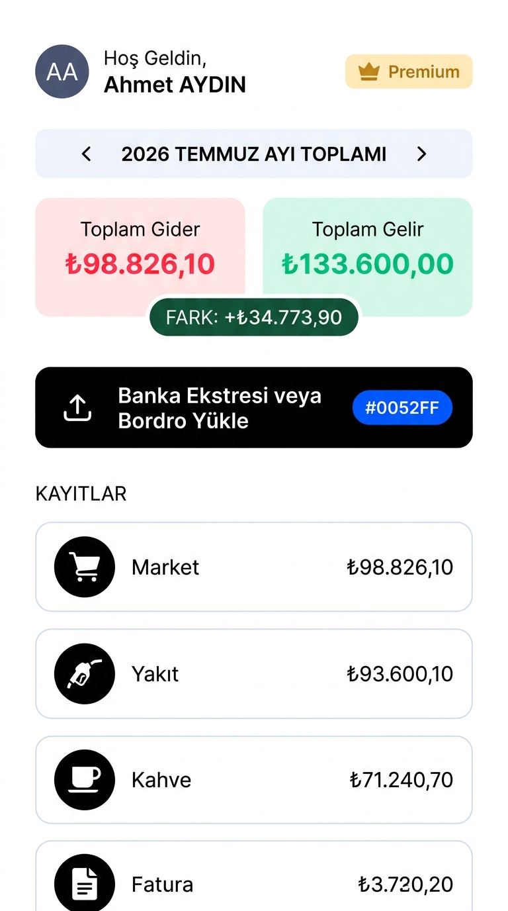
3. **Crystal Quick Entry (Hızlı Giriş):** 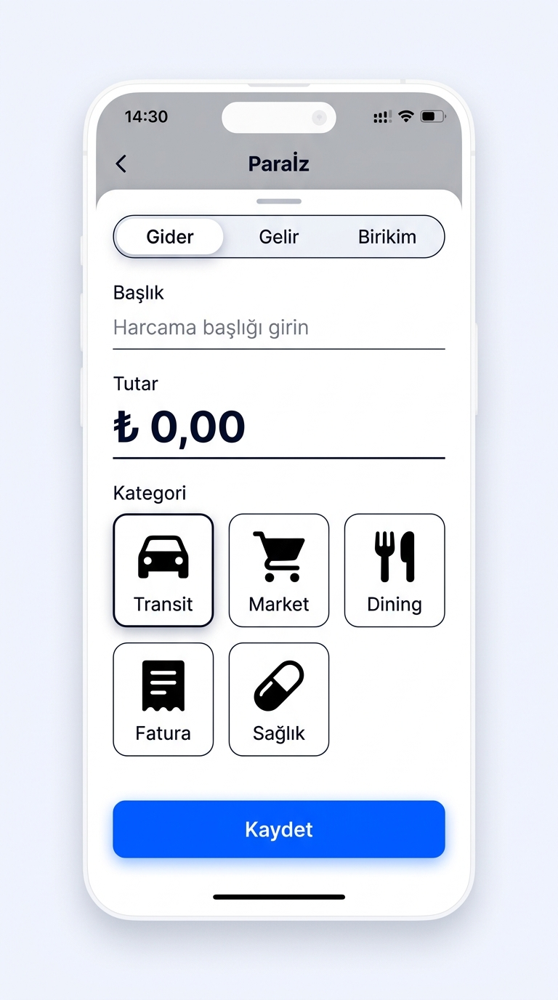
4. **Crystal Dashboard Silüet:** 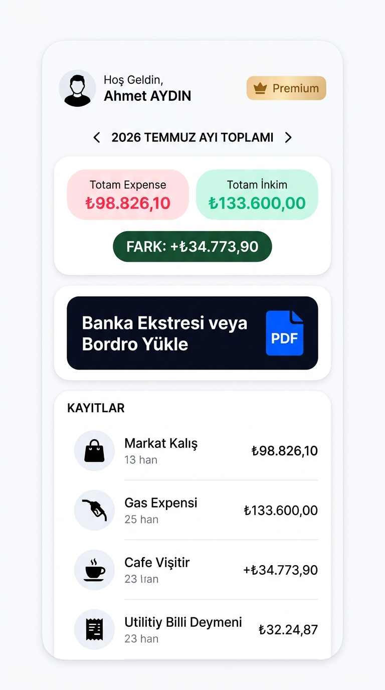
5. **Crystal Goals Silüet:** 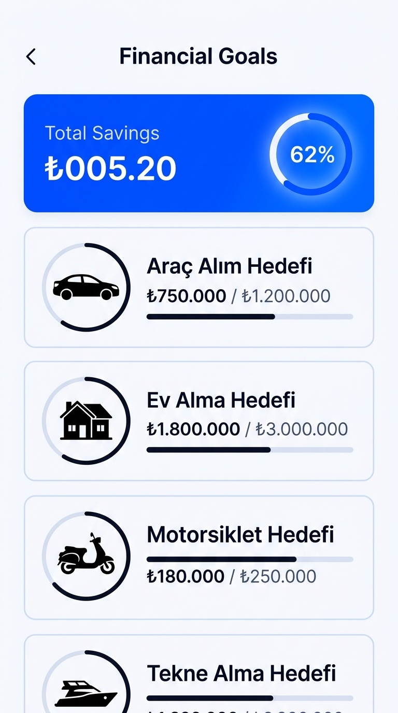
