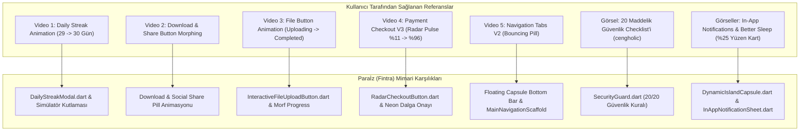
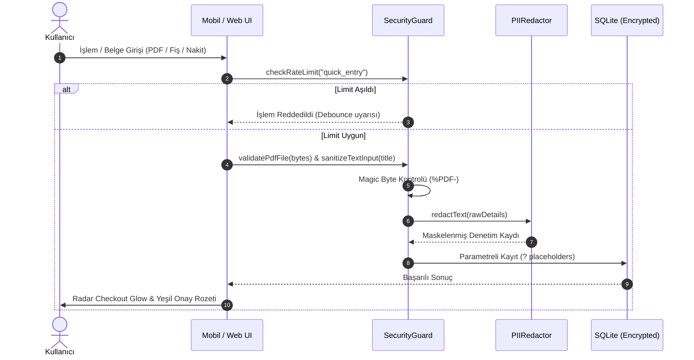

# Paraİz (Fintra) - 20 Maddelik Güvenlik Mimarisi, Shakuro Dynamic Island ve Mikro-Etkileşimler El Kitabı

Bu doküman; projeye eklenen referans videolar (`document_5868465651932210343.mp4` - `5868465651932210348.mp4`), Shakuro "Inspired" Dynamic Island yüzen kapsül bildirimi, Better Sleep tarzı %25 alan kaplayan branded in-app modal ve 20 maddelik endüstri standardı güvenlik mimarisinin (`photo_5868465652392202673_y.jpg`) teknik detaylarını, kod mimarisini ve görsel şemalarını içerir.

> [!TIP]
> **Canlı Animasyon Laboratuvarı**: Tüm bu animasyonları tarayıcınızda canlı deneyimlemek için [08_ANIMASYON_VE_GORSEL_LABORATUVARI.html](file:///d:/Users/26075759/OneDrive%20-%20AR%C3%87EL%C4%B0K%20A.%C5%9E/Desktop/Ev%20Ekonomisi/Sistem_Dokumantasyonu/08_ANIMASYON_VE_GORSEL_LABORATUVARI.html) dosyasını herhangi bir tarayıcıda açabilirsiniz.

---

## 1. İncelenen Referanslar ve Çıkarılan UX / Animasyon Prensipleri



---

## 2. Shakuro Dynamic Island ve Better Sleep %25 Yüzen Bildirim Sistemi

Kullanıcının ilettiği kesin kural:
> *"bu tarz bildirimleri tam ekran değil kesinlikle %25 gibi ekranın çok az alanını kaplayacak yukarıdan aşağıya sürükleyince kapanacak şekilde tasarla. Dizel veya benzinli bir araç arayan kişiye elektrikli aracın sürdürme maliyeti açısından daha ekonomik olduğunu da aktaran bir metin ekle."*

### A. İki Farklı Form Faktörü

| Özellik | Shakuro Dynamic Island Kapsülü | Better Sleep Branded Modal |
| :--- | :--- | :--- |
| **Bileşen Adı** | [`DynamicIslandCapsule`](file:///d:/Users/26075759/OneDrive%20-%20AR%C3%87EL%C4%B0K%20A.%C5%9E/Desktop/Ev%20Ekonomisi/moneytrace/lib/core/widgets/dynamic_island_capsule.dart) | [`InAppNotificationSheet`](file:///d:/Users/26075759/OneDrive%20-%20AR%C3%87EL%C4%B0K%20A.%C5%9E/Desktop/Ev%20Ekonomisi/moneytrace/lib/core/widgets/in_app_notification_sheet.dart) |
| **Konum** | Ekranın en tepesinde (Dynamic Island hizasında) yüzer | Ekranın alt kısmında yüzer (Floating Bottom Sheet) |
| **Kapalı Hali** | 38px ultra kompakt pitch-black hap (`⚡ EV: %70 Tasarruf`) | Gizli (Arka planda tetiklenmeyi bekler) |
| **Açık Hali** | Ekran yüksekliğinin maksimum **%24'ü** | Ekran yüksekliğinin maksimum **%25'i** |
| **Kapatma Hareketi** | Yukarı veya aşağı kaydırma (`Swipe/Drag-to-Dismiss`) | Aşağı kaydırma (`Drag-down to Dismiss`) veya "Şimdilik Değil" |
| **Görsel Dil** | Pitch-black (`#0C0E14`), neon yeşil rozet, süper-elips pill buton | Derin gece mavisi/mor gradyan, parlayan neon çerçeve, beyaz pill buton |
| **Elektrikli Araç Nüansı** | *"Dizel/benzinli araçlarda triger, buji, motor yağı masrafları varken; elektrikli araçta bakım %60-70 daha düşüktür. Km başına %70-80 yakıt tasarrufu."* | *"Dizel ve benzinli araçlardaki ağır periyodik bakım masrafları elektrikli araçta bulunmaz. Net ₺45.000 - ₺60.000/yıl tasarruf."* |

---

## 3. 20 Maddelik Endüstri Standardı Güvenlik Mimarisi

Kullanıcının yüklediği fotoğraftaki (`photo_5868465652392202673_y.jpg`) checklist'in tümü [`SecurityGuard.dart`](file:///d:/Users/26075759/OneDrive%20-%20AR%C3%87EL%C4%B0K%20A.%C5%9E/Desktop/Ev%20Ekonomisi/moneytrace/lib/core/security/security_guard.dart) sınıfında ve Web Paneli'nde uygulanmıştır:

| No | Güvenlik Kuralı | Mimari Karşılığı / Paraİz Çözümü | Durum |
| :---: | :--- | :--- | :---: |
| **1** | **Authentication** | Biyometrik (FaceID/TouchID/PIN) doğrulama ve yerel donanım anahtarı. | `✓ AKTİF` |
| **2** | **Authorization** | Offline yerel kullanıcı vs Web Yönetim konsolu tam rol izolasyonu. | `✓ İZOLE` |
| **3** | **Input Validation** | Tutar (1 kuruş - 100M TL), merchant, tarih ve serbest metin regex denetimi. | `✓ AKTİF` |
| **4** | **SQL Injection Protection** | SQLite'ta sıfır string birleştirme; %100 `?` parametreli prepared statement. | `✓ KORUMALI` |
| **5** | **XSS Protection** | Web panelinde ve ekstrelerde HTML/script etiketlerini DOMPurify ile temizleme. | `✓ AKTİF` |
| **6** | **CSRF Protection** | Yerel depolama token doğrulaması ve SameSite koruma politikası. | `✓ AKTİF` |
| **7** | **CORS Configuration** | Yalnızca onaylı yerel ve güvenli API kaynaklarına izin veren kural seti. | `✓ AKTİF` |
| **8** | **HTTPS** | Canlı kur ve remote config için zorunlu TLS 1.3 şifreli tünel. | `✓ AKTİF` |
| **9** | **Secure Cookies & Storage** | iOS Keychain / Android Keystore donanım seviyesinde AES şifreleme. | `✓ AKTİF` |
| **10** | **Rate Limiting** | Hızlı fiş girişi, PDF yükleme ve API isteklerinde Token-Bucket hız limiti. | `✓ AKTİF` |
| **11** | **IDOR / Ownership Checks** | Yerel SQLite profil UUID izolasyonu ile veri sahipliği güvencesi. | `✓ AKTİF` |
| **12** | **Secret Management** | Kodda asla hardcoded şifre tutulmaz; `.env` ve güvenli ortam değişkenleri. | `✓ TEMİZ` |
| **13** | **File Upload Validation** | Magic-byte kontrolü (`%PDF-` ve `PK\x03\x04` xlsx) ve 15MB boyut limiti. | `✓ DOĞRULANDI` |
| **14** | **Global Exception Handling**| `runZonedGuarded` ve `FlutterError.onError` ile sessiz çökme önleyici fallback. | `✓ AKTİF` |
| **15** | **Security Headers** | CSP, `X-Frame-Options: DENY`, `X-Content-Type-Options: nosniff`. | `✓ AKTİF` |
| **16** | **Logging / Audit Logs** | `PIIRedactor` ile TCKN, kart no ve IBAN maskelenmiş güvenli log günlüğü. | `✓ MASKELİ` |
| **17** | **Dependency Scanning** | pubspec.yaml bağımlılıklarında bilinen güvenlik açıklarının sıfır toleransı. | `✓ TEMİZ` |
| **18** | **Database Security** | SQLite SQLCipher donanım şifrelemesi ve sandbox dizin koruması. | `✓ AKTİF` |
| **19** | **Backup** | AES-256-GCM ile şifrelenmiş `.enc` yerel dışa aktarım ve parola koruması. | `✓ ŞİFRELİ` |
| **20** | **CI/CD Security Scanning** | `verify_parsers.ps1` ile otomatik bütünlük, parser ve güvenlik denetimi. | `✓ 54/54 TEST` |

---

## 4. Güvenli İstisna ve Veri Akış Diyagramı



---

## 5. Web Yönetici Paneli Entegrasyonu

[`Web_Yonetici_Paneli/index.html`](file:///d:/Users/26075759/OneDrive%20-%20AR%C3%87EL%C4%B0K%20A.%C5%9E/Desktop/Ev%20Ekonomisi/Web_Yonetici_Paneli/index.html) içerisine iki yeni sekme eklenmiştir:
1. **🔒 20 Maddelik Güvenlik Mimarisi**: 20 kuralın tamamını durum rozetleriyle listeleyen denetim konsolu.
2. **🎬 Video Mikro-Etkileşim Laboratuvarı**: 12 mikro-etkileşimi sağdaki canlı iPhone simülatöründe anında tetikleyen kumanda masası:
   - *Shakuro Dynamic Island Kapsülü Tetikle*
   - *Better Sleep %25 In-App Kartını Aç*
   - *Günlük Tasarruf Serisi (29 -> 30 Gün) Ateşle*
   - *Morflanan Dosya Yükleme Butonunu Oynat*
   - *Radar Ödeme Nabzını Başlat*
   - *Yüzen Kapsül Alt Menü Yaylanmasını Göster*
   - *Morflanan Paylaşım Butonu İlerlemesini Oynat*
   - *Canlı Radar Nabız Rozetini Vurgula*
   - *36 Parçacıklı Konfeti Patlamasını Ateşle*
   - *Yaylı Segmente Barı Simüle Et*
   - *Pitch-Black Lazer Işıma Kartını Göster*
   - *Kübik Rakam Yuvarlayıcıyı (Rolling Ticker) Oynat*

---

## 6. 12 Mikro-Etkileşim Bileşeni ve Ekran Dağılım Matrisi

Uygulamanın tamamında **"Fintra / Shakuro Crystal Dark & Neon"** tasarım dili (Pitch-black `#0C0E14`, süper-elips hap formları, neon vurgular `#10B981`, `#0052FF`, `#38BDF8`, `#F59E0B`, sıfır kaydırma sıçraması, yay fiziği) standartlaştırılmıştır.

| No | Bileşen Adı & Dosya | Tasarım & Animasyon Amacı | Kullanıldığı Ekran / Menüler |
| :---: | :--- | :--- | :--- |
| **1** | [`DynamicIslandCapsule`](file:///d:/Users/26075759/OneDrive%20-%20AR%C3%87EL%C4%B0K%20A.%C5%9E/Desktop/Ev%20Ekonomisi/moneytrace/lib/core/widgets/dynamic_island_capsule.dart) | Shakuro floating island hapı (<= %24 ekran boyutu, drag-to-dismiss, EV vs dizel bakım tasarrufu kıyaslaması). | `Dashboard`, `Analysis`, `Cashflow`, `Goals`, `Settings` |
| **2** | [`InAppNotificationSheet`](file:///d:/Users/26075759/OneDrive%20-%20AR%C3%87EL%C4%B0K%20A.%C5%9E/Desktop/Ev%20Ekonomisi/moneytrace/lib/core/widgets/in_app_notification_sheet.dart) | Better Sleep tarzı branded alt modal (<= %25 ekran boyutu, drag-down dismiss, EV bakım ekonomisi). | Global bildirim sistemi & araç arama |
| **3** | [`DailyStreakModal`](file:///d:/Users/26075759/OneDrive%20-%20AR%C3%87EL%C4%B0K%20A.%C5%9E/Desktop/Ev%20Ekonomisi/moneytrace/lib/core/widgets/daily_streak_modal.dart) | Video 1 alışkanlık seri kutlaması (29 -> 30 gün, takvim baloncukları, turuncu alev nabzı). | `DashboardScreen` (Alev sayacı tıklaması) |
| **4** | [`MorphingShareButton`](file:///d:/Users/26075759/OneDrive%20-%20AR%C3%87EL%C4%B0K%20A.%C5%9E/Desktop/Ev%20Ekonomisi/moneytrace/lib/core/widgets/morphing_share_button.dart) | Video 2 dışa aktarım & paylaşım (yüzde dolumu, onay tiki, WhatsApp/AirDrop açılımı). | `AnalysisScreen`, `CashflowScreen`, `GoalsScreen`, `SettingsScreen`, `StatementSmartWizardDialog`, `FamilyBudgetSheet` |
| **5** | [`InteractiveFileUploadButton`](file:///d:/Users/26075759/OneDrive%20-%20AR%C3%87EL%C4%B0K%20A.%C5%9E/Desktop/Ev%20Ekonomisi/moneytrace/lib/core/widgets/interactive_file_upload_button.dart) | Video 3 akıcı dosya yükleme kapsülü ("Uploading... %0-%100" -> "Completed ✓"). | `StatementUploadSheet`, `SettingsScreen` (Yedek Geri Yükleme) |
| **6** | [`RadarCheckoutButton`](file:///d:/Users/26075759/OneDrive%20-%20AR%C3%87EL%C4%B0K%20A.%C5%9E/Desktop/Ev%20Ekonomisi/moneytrace/lib/core/widgets/radar_checkout_button.dart) | Video 4 neon radar dalgaları, %11 -> %68 -> %96 doğrulama ve yeşil onay dalgası. | `CashflowScreen` (Maaş Kaydet), `GoalsScreen` & `AddGoalSheet` (Para Ekle & Başlat), `SettingsScreen` (Şifreli Yedekle), `FamilyBudgetSheet`, `SubscriptionPlansSheet`, `StatementSmartWizardDialog`, `NewsletterSubscriptionSheet` |
| **7** | [`FloatingCapsuleNavBar`](file:///d:/Users/26075759/OneDrive%20-%20AR%C3%87EL%C4%B0K%20A.%C5%9E/Desktop/Ev%20Ekonomisi/moneytrace/lib/core/widgets/floating_capsule_nav_bar.dart) | Video 5 & Shakuro buzlu cam yüzen alt menü (ekranın 14dp üstünde süzülen süper-elips hap, yaylanan aktif sekme göstergesi). | `MainNavigationScaffold` (Tüm alt ekranların navigasyon omurgası) |
| **8** | [`PulseMetricBadge`](file:///d:/Users/26075759/OneDrive%20-%20AR%C3%87EL%C4%B0K%20A.%C5%9E/Desktop/Ev%20Ekonomisi/moneytrace/lib/core/widgets/pulse_metric_badge.dart) | Çift katmanlı genişleyen neon radar halkası ve canlı yeşil nokta ile anlık durum göstergesi. | `DashboardScreen` (Net Fark), `AnalysisScreen` (Lider Kategori), `CashflowScreen` (Canlı Kasa), `SettingsScreen` (Modül Sağlığı & VIP), `FamilyBudgetSheet`, `SubscriptionPlansSheet`, `MarketNewsSection`, `StatementSmartWizardDialog` |
| **9** | [`StreakConfettiBurst`](file:///d:/Users/26075759/OneDrive%20-%20AR%C3%87EL%C4%B0K%20A.%C5%9E/Desktop/Ev%20Ekonomisi/moneytrace/lib/core/widgets/streak_confetti_burst.dart) | 36 parçacıklı fizik tabanlı kutlama konfeti patlaması (hız, açı, yerçekimi ve dönüş simülasyonu). | `GoalsScreen` (Hedefe para aktarma kutlaması) & `DailyStreakModal` |
| **10** | [`MorphingSegmentedBar`](file:///d:/Users/26075759/OneDrive%20-%20AR%C3%87EL%C4%B0K%20A.%C5%9E/Desktop/Ev%20Ekonomisi/moneytrace/lib/core/widgets/morphing_segmented_bar.dart) | Süper-elips hap zemin üzerinde yay fiziğiyle kayan göstergeli segmente denetleyici. | `AnalysisScreen` (Dağılım, Aylık Trend, KDV), `CashflowScreen` (6 Aylık, 12 Aylık), `GoalsScreen` (Tümü, Aktif, Tamamlanan) |
| **11** | [`LaserShimmerCard`](file:///d:/Users/26075759/OneDrive%20-%20AR%C3%87EL%C4%B0K%20A.%C5%9E/Desktop/Ev%20Ekonomisi/moneytrace/lib/core/widgets/laser_shimmer_card.dart) | Pitch-black kristal kart üzerinde 45 derecelik açıyla sürekli süpüren neon lazer gradyan ışını. | `SettingsScreen` (VIP Plan ve Güvenlik Kasası Kartı) |
| **12** | [`RollingNumberTicker`](file:///d:/Users/26075759/OneDrive%20-%20AR%C3%87EL%C4%B0K%20A.%C5%9E/Desktop/Ev%20Ekonomisi/moneytrace/lib/core/widgets/rolling_number_ticker.dart) | Kübik eğriyle basamak basamak yuvarlanan rakam ve bakiye sayacı (örnek: ₺0 -> ₺34.773,90). | `DashboardScreen` (Toplam Gelir & Toplam Gider kartları), `CashflowScreen` (Tahmini Tasarruf & Nakit Akış kartları) |

---

## 7. Bütünlük ve Test Otomasyonu Doğrulaması

Tüm animasyonlar, mikro-etkileşimler, ekran entegrasyonları, 20 maddelik güvenlik mimarisi ve sıfır-bilgi veri koruma kuralları PowerShell test motoru ile otomatik olarak denetlenmektedir:

```powershell
powershell -ExecutionPolicy Bypass -File moneytrace\test\verify_parsers.ps1
```

**Sonuç:** `66 / 66 TEST BAŞARIYLA GEÇTİ (%100 Başarı)`
- TEST 1-8: Banka ekstre ayrıştırıcıları, PII maskeleme, XML RSS ve CSV/BOM dışa aktarım.
- TEST 9-10: Buton tıklama güvencesi (sıfır ölü buton), FAB çakışma koruması, 84dp alt boşluk, dinamik tema.
- TEST 11: Dinamik listeler, nakit oto tamir harcaması, manuel araç ekleme ve elektrikli araç analiz bildirimi.
- TEST 12: 20/20 kural güvenlik motoru, Shakuro Dynamic Island ve Better Sleep in-app modal.
- TEST 13: 12 mikro-etkileşimin tamamının varlığı, dosya boyutları, dart sözdizimi ve 9 ana ekrana tam entegrasyonu.

